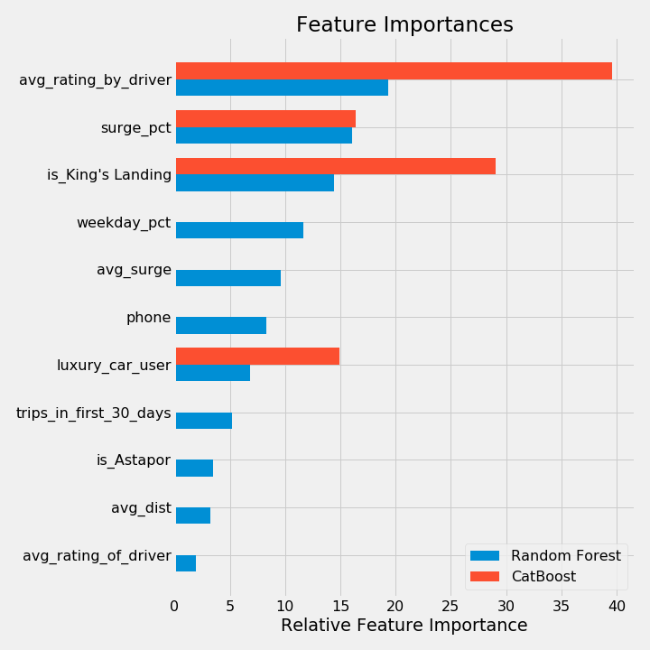
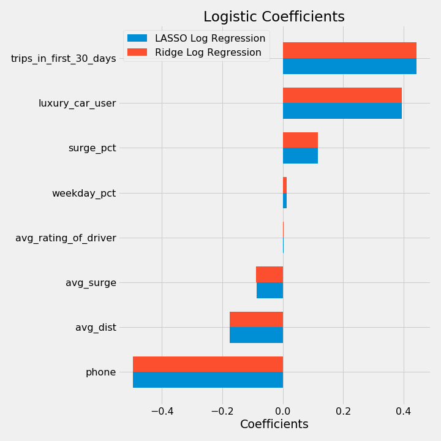
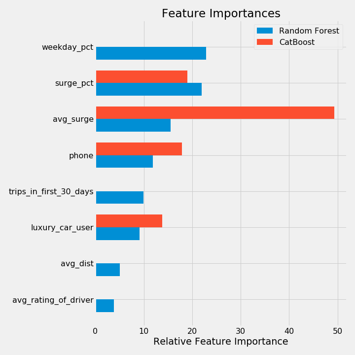

# Supervised Learning Case Study:   Predicting Rider Churn
Mike, Jacob, Clayton, Abel

## Introduction

We were asked to help "Company X", a rideshare company, analyze and reduce their rider churn. We were given records of 50,000 riders who signed up in **January of 2014**, and looked to analyze who and why had churned as of **June 1, 2014**. For our modeling, we trained on 40,000 randomly seleted riders, leaving 10,000 riders as unseen data.

## Goal

* We would like to use this dataset to help understand what factors are the best **predictors for retention**, and offer suggestions to help Company X. 

* Build a **model that minimizes error**, but also a model that allows you to **interpret the factors** that contributed to your predictions.

## Data Description & Impution 

* **Seems to be fictional dataset**, or the city names were purposely obscured. City names included: Winterfell, King's Landing and Astapor.

* **Column Names**: avg_dist, avg_rating_by_driver, avg_rating_of_driver, avg_surge, city, last_trip_date, phone, signup_date, surge_pct, trips_in_first_30_days, luxury_car_user, weekday_pct

* **Churn was assumed to be riders that have not taken a ride in the last 30 days since Date of Reference: June 1, 2014**

* Null Values (Overall, Train, Test):
    * avg_rating_by_driver: 201, 162, 39
    * avg_rating_of_driver: 8122, 6528, 1594
    * phone:                396, 319, 77

* To Impute:
    * **ratings:**  null = mean
    * **phones:**   null = 1 (aka iPhone)
        * There were 27947 iPhones, 12053 Andriods in churn_train, therefore we imputed as the most popular

## Exploratory Data Analysis

The following shows correlation of each feature in the dataset.

The following shows correlation of each feature in the dataset.

</img>

As you can see below, individuals who took smaller on average trips churned more often.

</img>

## Modeling 

The design matrix was first standardized in order to compare coefficients between features.

We tested 4 different models on the initial design matrix using all of the features. Below are the associated accuracies.

| Model Type   |   Accuracy |
|--------------|------------|
| LASSO Logistic Regression         |     0.716 |
| RIDGE Logistic Regression        |     0.716 |
| Random Forest           |     0.7896 |
| CatBoost         |     0.7391 |

The associated coefficients for the Logistic Regression models are below:

</img>
</img>

### Actionable Features

These models are informative and decent predictors but the features are not "actionable." This means that the variables from the feature cannot be used to prevent people from churning. It is just a good predictor.

| Model Type   |   Accuracy |
|--------------|------------|
| LASSO Logistic Regression         |     0.6936 |
| RIDGE Logistic Regression        |     0.6935 |
| Random Forest           |     0.7592 |
| Cat Boost         |     0.7262 |

</img>
</img>

## Conclusions

The next step is to use this data to do A/B tests targeting the features below. This will inform us if the predictive power of these features is due to causation or mere correlation.

| Feature to target   |
|--------------|
| Trips in first 30 days |
| Luxury car user |
| Android users  |
| Customers not riding during surge |

## Future Work

Tune the hyper paramters in order to get better accuracies from the model. This will give us more confidence in the inferences taken from the models.
