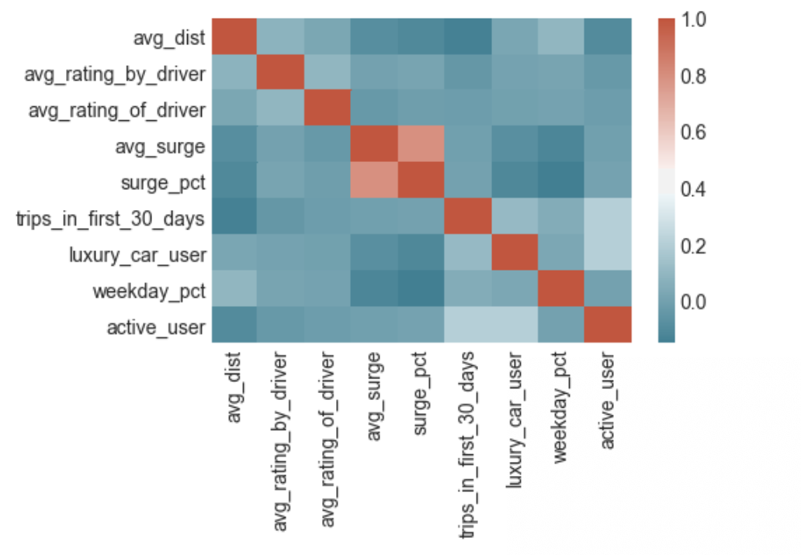
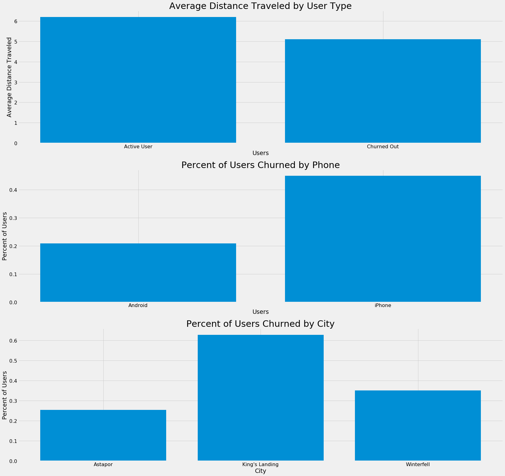

# Supervised Learning Case Study:   Predicting Rider Churn
Mike, Jacob, Clayton, Abel

## Introduction

We were asked to help "Company X", a rideshare company, analyze and reduce their rider churn. We were given records of 50,000 riders who signed up in **January of 2014**, and looked to analyze who and why had churned as of **June 1, 2014**. For our modeling, we trained on 40,000 randomly seleted riders, leaving 10,000 riders as unseen data.

## Goal

* We would like to use this dataset to help understand what factors are the best **predictors for retention**, and offer suggestions to help Company X. 

* Build a **model that minimizes error**, but also a model that allows you to **interpret the factors** that contributed to your predictions.

## Data Description & Impution 

* **Seems to be fictional dataset**, or the city names were purposely obscured. City names included: Winterfell, King's Landing and Astapor.

* **Column Names**: avg_dist, avg_rating_by_driver, avg_rating_of_driver, avg_surge, city, last_trip_date, phone, signup_date, surge_pct, trips_in_first_30_days, luxury_car_user, weekday_pct

* **Churn was assumed to be riders that have not taken a ride in the last 30 days since Date of Reference: June 1, 2014**

* Null Values (Overall, Train, Test):
    * avg_rating_by_driver: 201, 162, 39
    * avg_rating_of_driver: 8122, 6528, 1594
    * phone:                396, 319, 77

* To Impute:
    * **ratings:**  null = mean
    * **phones:**   null = 1 (aka iPhone)
        * There were 27947 iPhones, 12053 Andriods in churn_train, therefore we imputed as the most popular

## Exploritory Data Analysis

The following shows correlation of each feature in the dataset. 

</img>

As you can see below, individuals who took smaller on average trips churned more often.

</img>

## Modeling 

## Conclusions

